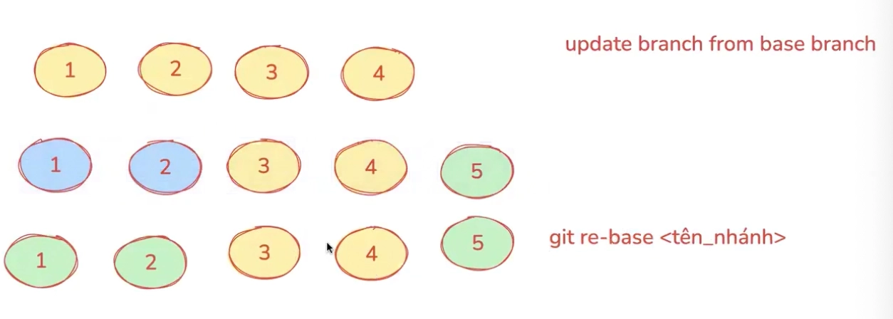
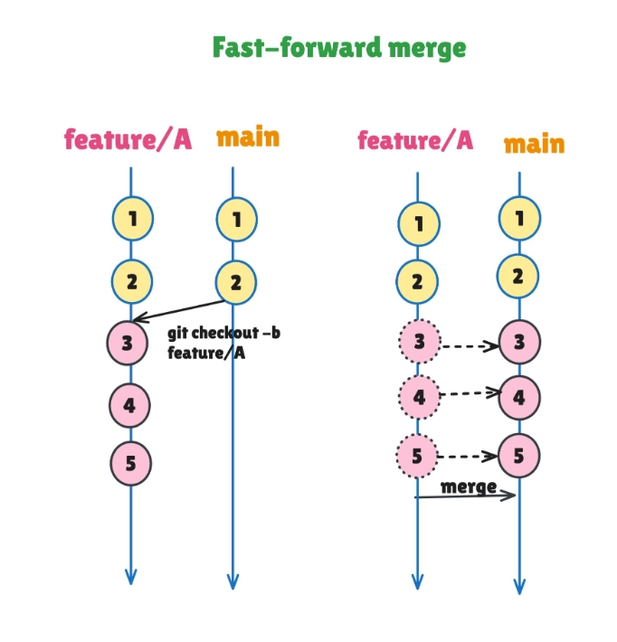
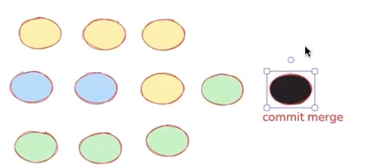
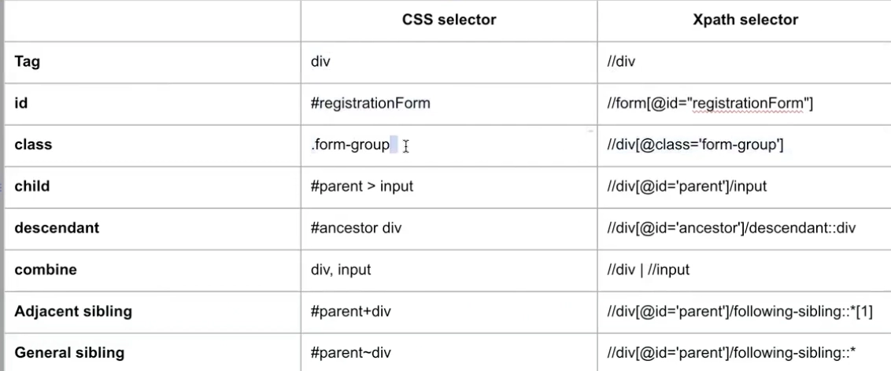

# GIT
## git rebase

`git rebase <branch_name>` uses to get all changes from the main branch into feature branch, to assure that the feature branch have the latest version
⇒ new commit from the feature branch will be latest



It will not create the redundant merge commit

## squash

`git rebase -i HEAD~<numberOfCommit>`

`-i` : interactive

It occurs when having many commits (for 1 feature) want to group 

For ex:

- Having 3 commits for login features
1. When run cmd `git rebase -i HEAD~3` 
⇒ pick 3 latest commits 
⇒ change VIM to INSERT 
⇒ Update the ‘pick’ into ‘s’ for the commit 2nd, 3rd ( group all commits and 1st is the root) 
⇒ quit
2. Display VIM again to update the commit message
- Can update and comments the unnecessary commits by ‘#’
⇒ quit
⇒ check log will see that only one commit instead of 3 

## conflict

It occurs when there are multiple changes from some branches want to merge into one position

`<<< HEAD`  `====` : the content of the current branch

`====` `>>>>` : the content of the branch which wants to merge into current branch

- Remove this symbol and select the context want to keep
- Git add ⇒ commit
⇒ Merge the updates into main

## git merge

`git merge` use to merge the code from many branches into one branch

Ex:

`git merge feature/check-in` 

It means merging changes in feature/check-in into main

### Fast-forward merge

When didn’t have any changes in main branch, from checking out the feature branch



### Three way merge

We have 2 feature branches checkout from commit 2 of main branch

Feature branch 1: Main merge commit’s FB1 
Main: having 3 commits (2-self and 1-FB1)

Feature branch 2: Main merge commit’s FB2

Main: having 5 commits (2-self, 1-FB1, 1-FB2, 1 for FB1 + FB2)



# Selectors

## CSS selector

- Short, high performance
- For easy element
- Not flexible as XPath

https://appletree.or.kr/quick_reference_cards/CSS/CSS%20selectors%20cheatsheet.pdf

https://hoctest.com/khoa-hoc/fullstack-automation-qa-tu-chua-biet-gi-voi-playwright-typescript/bai-hoc/bo-sung-css-selector/

Compare CSS selector and Xpath


## Playwright selector

- For only Playwright
- Short-hand Syntax, not depend on DOM structure
- Can use browser run test Playwright to check element

### getByRole()

- Get the element by role, and `name` text
    
    ```jsx
    // Element have
    Heading: for male
    Heading: for female
    ```
    
    - If use `Male`  in name, Playwright will check the contained value `male` ⇒ return issue since having 2 elements contain `male`
        
        ```jsx
        page.getByRole('heading', {name: "Male"}).textContent(); 
        ```
        
    - To find exact:
        
        ```jsx
        page.getByRole('heading', {name: "Male", exact: true }).textContent(); 
        ```
        
    - If use xpath
        
        ```jsx
        page.locator('//h1[@id=self]').textContext();
        ```
        
- Get element from listitem
    
    ```jsx
    page.getByRole('listitem')
        .filter({ hasText: 'Honda' })
    ```
    
    Since “Honda” is not an accessible name, 
    Accessible name in this case is `Car Honda` 
    
    ```jsx
    <li>
        Car
        <span>Honda</span>
    </li>
    ```
    

**Roles:**

- button
- link
- textbox
- checkbox
- radio
- heading
- listitem

### getByText()

- Search an element by the text
    
    ```jsx
    page.getByText('Welcome', {exact: false}); 
    ```
    
- Chaining locator
    
    ```jsx
    page.locator('span').getByText('Welcome', {exact: false}); 
    ```
    

### getByLabel()

`getByLabel(text, options);`

- Search an element by the label
    
    ```jsx
    page.getByLabel('Password', { exact: false }).fill('secret'); 
    ```
    

### getByTitle()

`getByTitle(text, options);`

- Search an element by the title of element
    
    ```jsx
    ‹span title='Issues count' >25 issues</span›
    ```
    
    ```jsx
    page.getByLabel('Issues count', { exact: false }).toHaveText('25 issues'); 
    ```