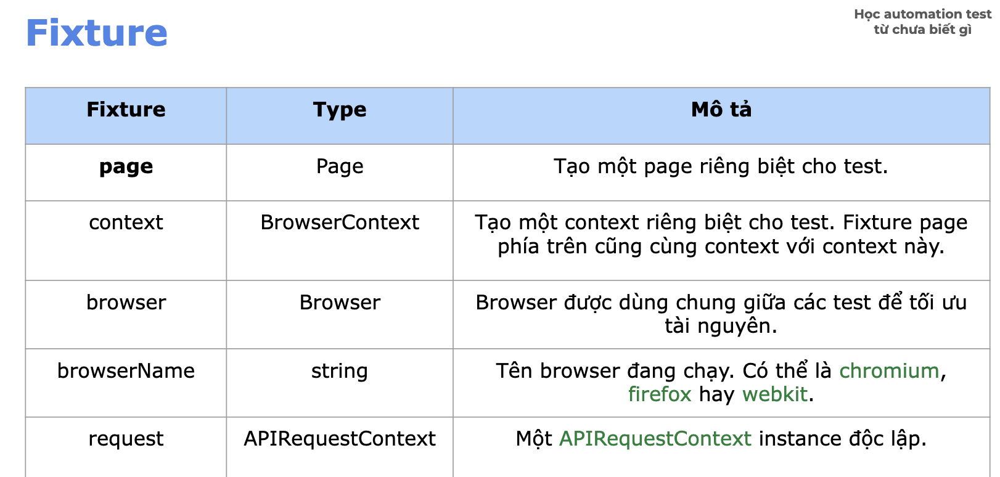
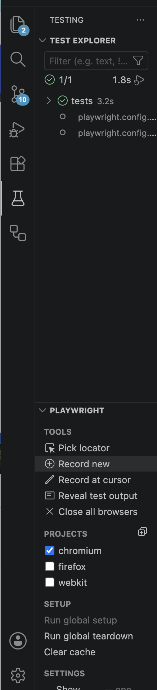

# Object destructuring

Use for getting values of properties in object

⇒ Make code shorter

Without object destructuring

```jsx
const myClass = {
	school: 'ACB',
	course: ' Fullstack'
};

const school = myClass.school;
const course = myClass.course;
```

With object destructuring

```jsx
const { school, course } = myClass;
```

#

# Fixtures

Supports to prepare

- Import browser
- Browser ⇒ session
- Open new tab

**Example:**

({page}) is a fixture

If don’t import {page}


## page

As a tab on browser

```jsx
import { chromium } from '@playwright/test';

(async () => {
    const browser = await chromium.launch({ headless: false });
    
    // Create new context - same as a working session
    const context = await browser.newContext();
    
    const page = await context.newPage();

    await page.goto('https://google.com');

    await page.pause();

    await browser.close();
})();
```

## context

As a browser session/ profile/ Incognito Window

- Cookie
- LocalStorage
- SessionStorage
- Login state
- Permissions
- Cache

### Ex1: 
Go to multiple pages with one profile (context)**

```tsx
test('Multiple pages with one profile', async ({ context }) => {
  const page1 = await context.newPage();

  const page2 = await context.newPage();

  await page1.goto("https://google.com");

  await page2.goto("https://youtube.com");

});
```

### Ex2:
Why we need contexts:**

```jsx
test('Admin', async ({ page }) => {
   await loginAsAdmin();
});

test('User', async ({ page }) => {
   await loginAsUser();
});
```

If using the common context 

```jsx
Admin login
User login
```

Cookie will be override

### Ex3: 
Different contexts**

```jsx
const page1 = await context1.newPage();
const page2 = await context2.newPage();
```

```jsx
Browser
├── Context 1
│    └── Page 1
└── Context 2
     └── Page 2
```

In Page 1:

```jsx
await login(page1);
```

In Page 2:

```jsx
await page2.goto('gmail.com');
```

⇒ Have not login yet 

⇒ Since different context

## browser

A browser as Chrome/ Firefox/ Edge

```jsx
test('Open multiple browsers', async ({ browser }) => {

  const context1 = await browser.newContext();

  const context2 = await browser.newContext();

  const page1 = await context1.newPage();

  await page1.goto("https://google.com");

  const page2 = await context2.newPage();

  await page2.goto("https://youtube.com");

});
```

Using `browser` for custom context and setup beforeAll

## request

Use for call API

```jsx
test('api', async ({ request }) => {
    const response = await request.get('/users');
});
```

- Create test data
- Login API
- Cleanup data
- API testing

## fixture file

```jsx
import { test as base, expect } from '@playwright/test';
import { MaterialPage } from './pages/material-page';

type Fixture = {
    materialPage: MaterialPage;
}

export const test = base.extend <Fixture> ({
    materialPage : async ({page}, use) => {
        const materialPage = new MaterialPage(page);

        // setup
        await materialPage.openMaterialPage();
        await expect(materialPage.heading('Tài liệu học automation test', 1)).toBeVisible();

        await use(materialPage);
        
        // teardown
        console.log('End of test')
    },
    // add other fixtures
})

export { expect };
```

In test

```jsx
import { test, expect } from './fixtures'
import { RegisterPage } from './pages/register-page';
import { registerUserData } from './test-data/user-data';

test('Registration', async ({materialPage, page}) => {
    // Run fixture "materialPage" at this step
    
    // Continue other steps
    const registerPage = new RegisterPage(page);

    await test.step('Go to User Registration page', async () => {
        await materialPage.gotoPage('Register Page');
        await expect(registerPage.heading('User Registration',1)).toBeVisible();
    });
    });
```
#
# Gen code - Record test video

## Gen code

Using Playwright tool “Record new” to start recording step by step



## Record test video

Turn on feature in `playwright.config.ts` file

```jsx
  use: {
    video: 'on'
  },
```

- `'off'`: Do not record video.
- `'on'`: Record and keep a video for every run.
- `'on-first-retry'`: Record and keep a video only for the first retry of a test.
- `'on-all-retries'`: Record and keep a video for every retry.